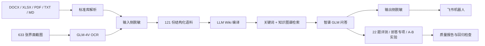

# 架构与演示

这是一份面向招聘方和代码审阅者的快速入口。项目重点不是简单调用模型，而是把企业内部资料变成一条可治理、可评测、可追溯的知识问答链路。

## 系统架构

本地原始资料、知识库、模型密钥与公开 GitHub 仓库物理隔离。发布前还会执行路径白名单、密钥特征和输出产物脱敏检查。

## 当前可验证结果

| 项目 | 结果 | 证据 |
|---|---:|---|
| 数据处理 | 173 文件 / 153MB → 121 份 / 105.2 万字符 | `scripts/corpus_stats.py` |
| OCR | 633 张截图 → 43 份入库文档 | `scripts/check_coverage.py` |
| 脱敏 | 4,667 处；输入侧与公开评测产物零残留 | `scripts/audit_leaks.py`、`scripts/sanitize_eval_results.py` |
| 知识库 | 119/119 来源；822 页 Wiki | `scripts/wiki_status.py`、`scripts/check_coverage.py` |
| 主评测 | 18~19/21；幻觉 0/21；引用 22/22 | `eval/评测报告_v1.1_知识固化与稳定性.md` |
| 拒答专项 | 语料外 8/8 正确拒答；语料内 5/5 无误拒 | `eval/拒答评测报告.md` |
| 延迟优化 | P50 61.5s → 18.0s | `eval/评测报告_v1.0_检索深度与快模型.md` |

`0/21` 不代表真实幻觉率为零；95% 置信上界仍为 13.3%。项目保留这一统计边界，避免用小样本过度承诺。

## 三分钟审阅路径

1. 看根目录 `README.md` 的量化结果和关键决策。
2. 看 `eval/README.md` 了解每轮评测产物与口径。
3. 运行离线验收：`python scripts/project_acceptance.py`。
4. 有本地私有数据与 LLM Wiki 时运行：`python scripts/project_acceptance.py --live`。

离线验收不调用模型、不联网，也不需要私有语料；它会检查源码可编译、评测产物规模、引用链和公开交付文件。`--live` 另外检查 API、当前项目、119 份来源和 Wiki 页面规模。

## 面试演示建议

建议录制 60–90 秒脱敏视频或 GIF，不在公开仓库直播真实业务资料：

1. 飞书群内 @机器人提出一个已脱敏业务问题。
2. 展示卡片回答、来源引用和一次多轮追问。
3. 切到终端运行 `project_acceptance.py --live`，证明系统不是静态截图。
4. 最后展示一次失败边界：知识库外问题会拒答，而不是用模型常识强答。

## 已知边界

- LLM Wiki 是本地桌面服务，在线问答需要应用保持运行。
- 当前生产检索是关键词 + 知识图谱；向量索引虽已构建，但查询期额度不足，未计入效果归因。
- 复杂对比题受应用 Agent 工具步数上限影响，因此主指标报告区间与复跑次数，不只展示最好单轮。
- 公开仓库不含真实业务语料，复现重点是工程代码、脱敏规则、评测框架和证据产物。
